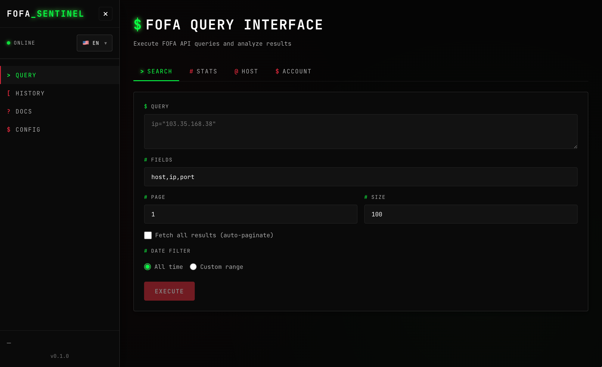

# FOFA Sentinel

<div align="center">


A modern, hacker-style web application for proactive security reconnaissance using the FOFA API.

[English](./README.md) • [简体中文](./README_zh-CN.md) • [繁體中文](./README_zh-TW.md)

[Features](#features) • [Installation](#getting-started) • [Documentation](#documentation) • [Contributing](./CONTRIBUTING.md)

</div>

## Screenshot

<div align="center">



*FOFA Sentinel Query Interface*

</div>

## Features

- 🔍 **Complete FOFA API Integration** - All API endpoints supported
- 💾 **Query History** - Save and manage your search queries
- 📊 **Result Storage** - Store query results in SQLite database
- 📄 **Export Results** - Export results in JSON, TXT, or CSV formats
- 🔐 **API Key Management** - Secure API key storage
- 🎨 **Hacker-Style UI** - Modern, professional interface with terminal aesthetics

## Tech Stack

- **Frontend**: React + TypeScript + Vite
- **Backend**: Node.js + Express + TypeScript
- **Database**: SQLite (better-sqlite3)

## Getting Started

### Prerequisites

- Node.js 18+ 
- npm or yarn

### Installation

```bash
# Install dependencies
npm install

# Copy environment file (optional)
cp .env.example .env

# Run development server (both frontend and backend)
npm run dev
```

The application will be available at:
- Frontend: http://localhost:3000
- Backend API: http://localhost:3002 (default, configurable via `.env`)

### First Time Setup

1. Start the application: `npm run dev`
2. Navigate to the Settings page (CONFIG in sidebar)
3. Enter your FOFA API Key from https://fofa.info/user/personal
4. Click "SAVE" to store your credentials
   - Note: Your email will be automatically retrieved from your account info

### Build for Production

```bash
npm run build
```

### Running Production Build

After building, you can run the production server:

```bash
# Start the server
npm run build:server

# The server will run on port 3002 (or PORT from .env)
# Serve the frontend build from dist/client using any static file server
```

## Documentation

- [Environment Variables](./docs/ENVIRONMENT.md) - Configuration guide
- [Troubleshooting](./docs/TROUBLESHOOTING.md) - Common issues and solutions
- [Contributing](./CONTRIBUTING.md) - How to contribute
- [Changelog](./CHANGELOG.md) - Version history

## Project Structure

```
fofa/
├── src/
│   ├── server/          # Backend server
│   │   ├── index.ts     # Server entry point
│   │   ├── routes/      # API routes
│   │   ├── db/          # Database setup
│   │   └── services/    # Business logic
│   ├── client/          # Frontend React app
│   │   ├── components/  # React components
│   │   ├── pages/       # Page components
│   │   ├── hooks/       # Custom hooks
│   │   └── utils/       # Utilities
│   └── shared/          # Shared types
├── docs/                # Documentation
├── .github/             # GitHub templates and workflows
├── data/                # SQLite database files
└── public/              # Static assets
```

## API Endpoints

### FOFA API Wrapper
- `POST /api/fofa/search` - Search hosts
- `POST /api/fofa/stats` - Get statistics
- `POST /api/fofa/host` - Host aggregation
- `GET /api/fofa/account` - Account information
- `POST /api/fofa/search-after` - Search after (pagination)

### Application API
- `GET /api/history` - Get query history
- `GET /api/history/:id` - Get specific query
- `DELETE /api/history/:id` - Delete query
- `GET /api/results/:id` - Get query results
- `POST /api/export/:id` - Export results as TXT
- `POST /api/config/key` - Save API key
- `GET /api/config/key` - Get API key (masked)

## Contributing

Contributions are welcome! Please read our [Contributing Guide](./CONTRIBUTING.md) for details on our code of conduct and the process for submitting pull requests.

## License

This project is licensed under the MIT License - see the [LICENSE](./LICENSE) file for details.

## Acknowledgments

- [FOFA](https://fofa.info/) - For providing the excellent security search engine API
- Design inspiration from terminal and hacker aesthetics

## Support

If you find this project helpful, please consider giving it a ⭐ on GitHub!

---

Made with ❤️ by the FOFA Sentinel contributors

